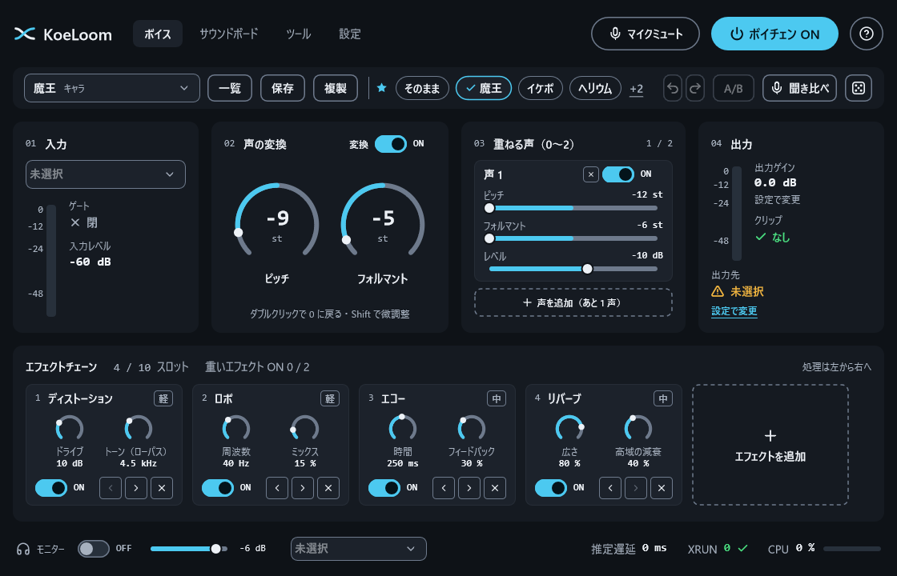
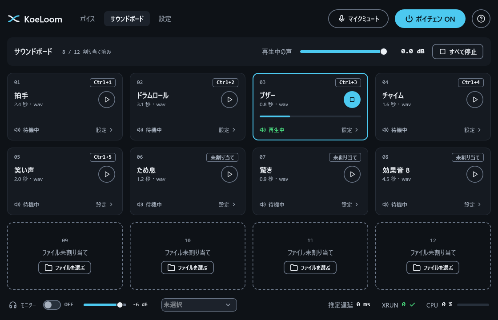
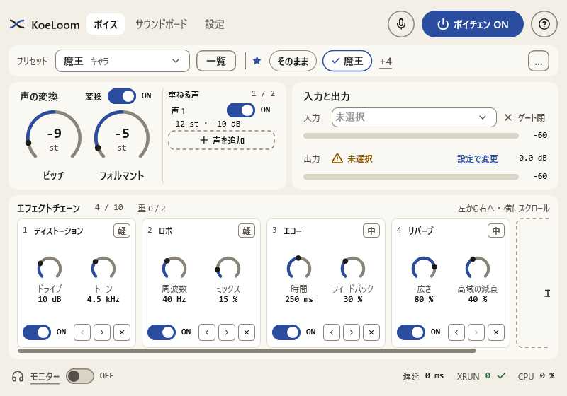
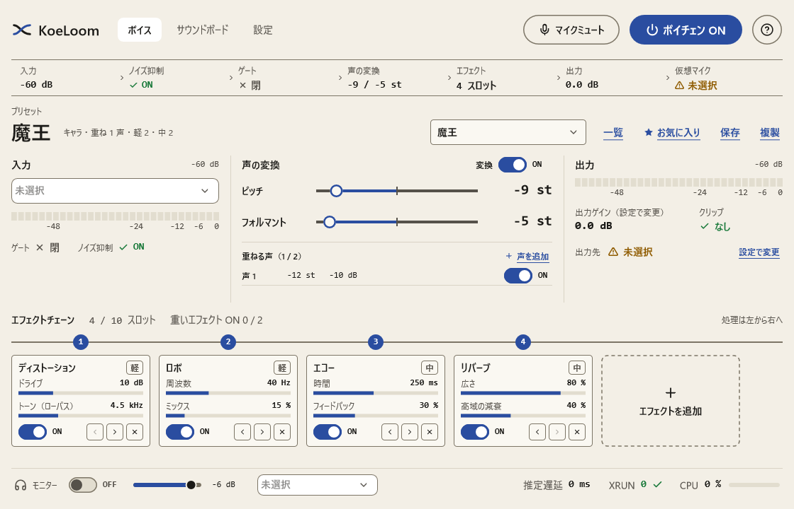
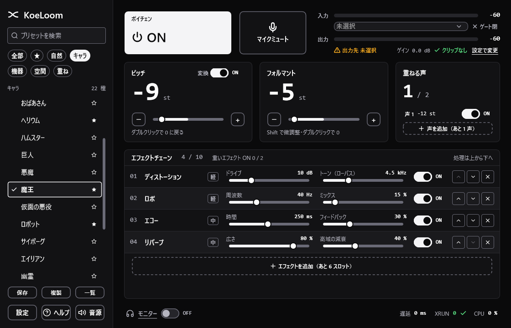
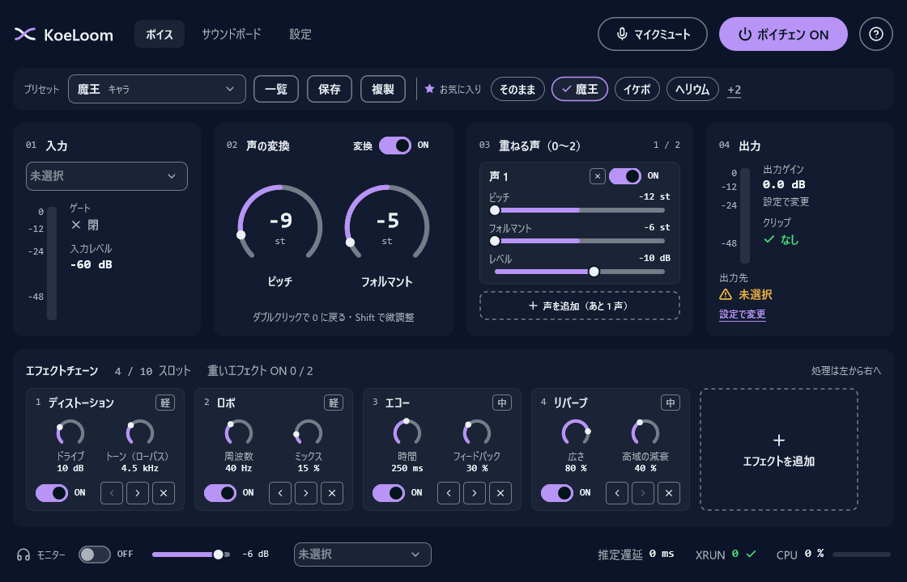
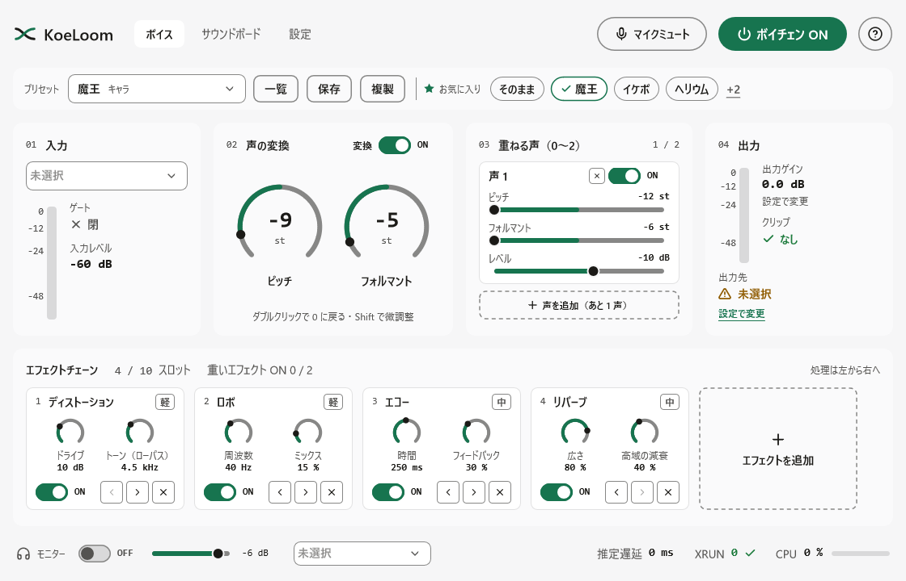
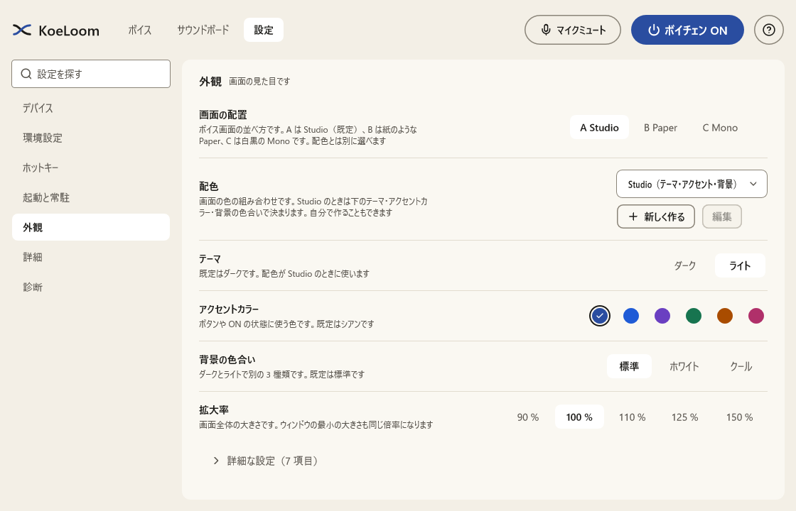
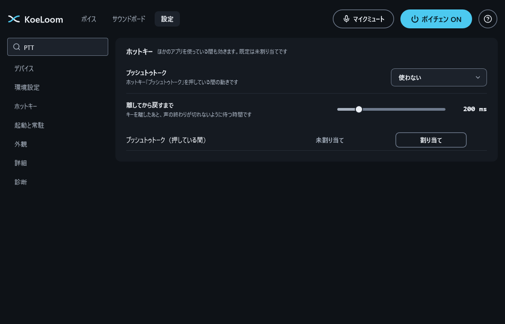

# KoeLoom

Discord などの通話アプリで使える、GUI 付きのボイスチェンジャーです（Windows 11）。声の変換は DSP（信号処理）だけで行い、AI 変換は使いません。

> **状態: 作者の PC（Windows 11、VB-CABLE）で動くことを確かめました（v0.3.1）。自動テストは 31797 件。** 内蔵プリセットの音量は、読み上げ音声で合わせた暫定値です（「ツール」の「音量合わせ」で自分の声に合わせられます）。



## しくみ

```
マイク → KoeLoom（変換・エフェクト） → 仮想ケーブル → 通話アプリの入力デバイス
```

- KoeLoom は、マイクの声を加工して、仮想オーディオケーブルへ出力します。通話アプリ側は、入力デバイスにその仮想ケーブルを選びます。
- 通話アプリのクライアントや API には触れません。仮想マイクを入力に選べるアプリなら、Discord 以外でも使えます。
- 仮想ケーブル（VB-CABLE など）は、このリポジトリに**含めません**。利用者が、配布元から入れます。VB-CABLE は VB-Audio Software の製品で、このプロジェクトとは関係がありません。

## 機能

- ピッチ（声の高さ）とフォルマント（声質）の変換（自前の位相ボコーダー、遅延 32 ms）、最大 2 声の重ねがけ（固定 / スケール連動）
- エフェクト 31 種を、最大 10 スロットに、好きな順で並べるチェーン（フリーズ、ルーパー、オートピッチ、ボコーダーなど Phase 5 の 6 種を含む）。多くはタイプを選べる: リバーブ 11 タイプ（ルーム・ホール・プレート・スプリング・アンビエンス・大聖堂・ゲート・リバース・シマー・洞窟・浴室）、エコー 6 タイプ、ボイスキャラクター 10 種類（電話・ラジオ・宇宙服のヘルメット・水中・壁越し・古いレコード・ガスマスク・スタジアム など）、ひずみ 6 タイプ、サチュレーター 4 タイプ
- **残響ファイル**: 手持ちの WAV / FLAC / AIFF の残響（IR）を読み込んで、その部屋や機材の響きをかける
- 「聞き比べ」ボタン（押している間だけ元の声）と「おまかせ」ボタン（ランダムな声を作る。気に入ったら保存）
- 「ツール」ページ: **試し録り**（録った声をくり返し加工して聞く。相手には送らない）、**録音**（加工した声を WAV に保存）、**声の高さ**（いまの声と加工後の Hz・音名・グラフ）、**混ぜる**（2 つのプリセットの間をスライダーで行き来して保存）、**音量合わせ**（自分の声で内蔵プリセットの音量をそろえる）
- **押している間だけのエフェクト**（ホットキーを押している間だけ、やまびこ・大聖堂・電話・ロボットなどがかかる）と、**アプリごとの自動切り替え**（決めたゲームが前に出るとそのプリセットに）
- 内蔵プリセット 81 種（自然な補正からネタ系まで）と、ユーザープリセット（保存・複製・インポート / エクスポート・お気に入り 9 件）
- ノイズ抑制（RNNoise）、ノイズゲート、モニター（自分の声の確認。別デバイスのずれを自動で補正）、サウンドボード（12 枠）、ホットキー
- 出力音量は、入力と同程度を基準にして、設定で -24〜+12 dB の範囲で調整。最後にリミッター（-1 dBFS）
- 画面の配置を 3 種類から選べる（A Studio・B Paper・C Mono）。配色は Studio（ダーク / ライト × アクセント色 6 種 × 背景 3 種）・Paper・Mono に加えて、**自分で作れる**（役割ごとに色を選び、読みやすさを確かめて保存。書き出し / 読み込みで人と共有できる）
- 細かい設定（変換の品質、自動音量、低域カット、リミッター、プッシュトゥトーク、排他モード、入力チャンネル、モニターの遅延、画面の拡大率、常に手前に表示 など 40 項目ほど）。設定画面は検索でき、普段使わない項目は「詳細な設定」に畳んである
- 新しい版の自動更新（既定は OFF。ON にしたときだけ GitHub の公開ページを確認して、終了時に置き換える。OFF のときは通信しない）
- 初回セットアップ、ガイドツアー、キーボードだけでの操作、タスクトレイ常駐

## 画面

| サウンドボード | 狭いウィンドウ（800×560、ライト） |
|---|---|
|  |  |

| 配置 B「Paper」 | 配置 C「Mono」 |
|---|---|
|  |  |

| アクセント色と背景を変えた例 | |
|---|---|
|  |  |

配置と配色は「設定 → 外観」で選べます。設定画面は検索できます（例: 「PTT」）。

| 設定 → 外観 | 設定の検索 |
|---|---|
|  |  |

画像は `KoeLoom.exe --snapshot <フォルダ>` で書き出したものです（窓を出さずに描きます。デバイス名や音量は空の状態です）。

## ダウンロード

ビルド済みの `KoeLoom.exe` は [Releases](https://github.com/takosasi-dev/koe-loom/releases) に置きます。今はプレリリース（実機での確認前）だけです。インストーラーは無く、exe 1 つで動きます。

## ビルド

Visual Studio 2022（C++ のデスクトップ開発）と CMake が要ります。JUCE 8.0.6 は初回に自動で取得します。JUCE は日本語や記号を含むパスでビルドできないため、`tools\build.ps1` は ASCII のパスからビルドします（リポジトリが日本語などを含むフォルダにあるときは、同じドライブの `koe-loom` というジャンクションを使います）。

```powershell
powershell -ExecutionPolicy Bypass -File tools\build.ps1 -Test   # ビルド + 全テスト、dist\KoeLoom.exe に写す
```

## できないこと

- 声そのものが、別人の声に変わるわけではありません。「女声寄り」「少年」などは、聞こえ方の自然さに限界があります。
- 特定の人物やキャラクターの声を再現するものではありません。
- Windows 11（x64）以外は、対象外です。

## 動作環境

Windows 11（x64）。通話アプリに声を届けるには、仮想オーディオケーブル（VB-CABLE など）を別に入れます。

## ライセンス

[AGPL-3.0](LICENSE)。

JUCE は、AGPLv3 と商用ライセンスのデュアルライセンスです。このプロジェクトは公開するので、AGPLv3 を選び、本ソフト全体を AGPL-3.0 で公開します。使っている外部のコードは [THIRD_PARTY_NOTICES.md](THIRD_PARTY_NOTICES.md) にまとめます。

## 開発の進め方

- 技術検証の作業フォルダ: [`phase0/`](phase0/)
- 変更履歴: [CHANGELOG.md](CHANGELOG.md)
- バージョンは `vMAJOR.MINOR.PATCH`。公開直後は `v0.x.x` とします。
