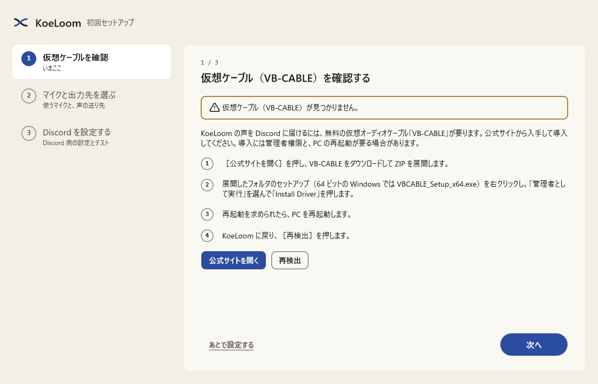
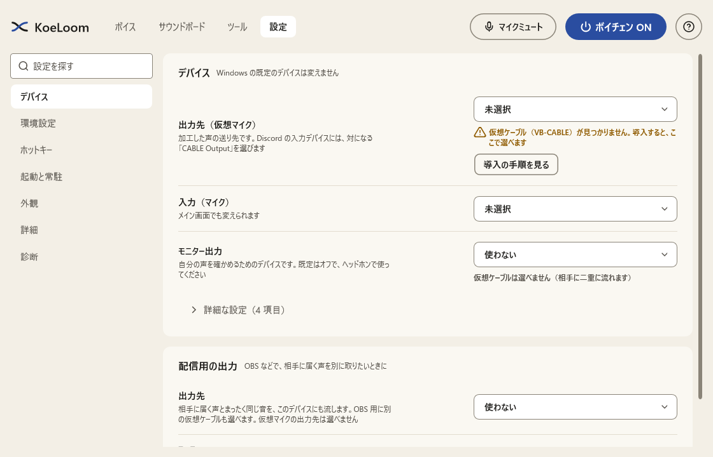
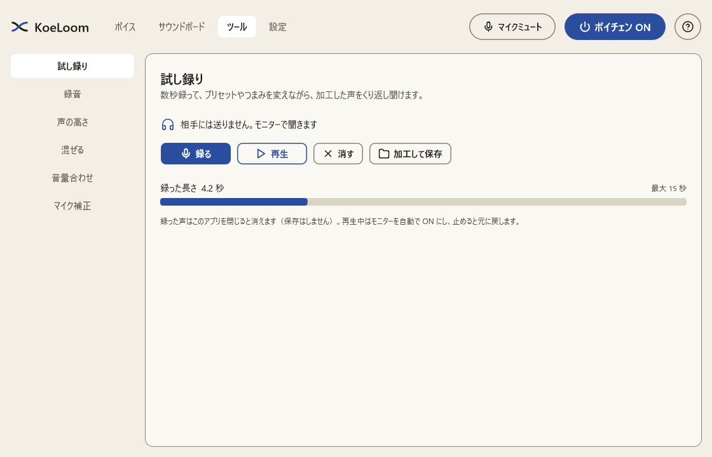

# KoeLoom の使い方

KoeLoom は、マイクの声をその場で加工して、Discord などの通話アプリに届けるソフトです。この説明書では、入れ方から、ふだんの使い方、便利な機能までを順に説明します。

- 対象: Windows 11（64 ビット）
- 用意するもの: マイク、ヘッドホン（自分の声を確かめるとき）、仮想オーディオケーブル「VB-CABLE」（無料）

## 目次

1. [しくみ](#1-しくみ)
2. [VB-CABLE を入れる](#2-vb-cable-を入れる)
3. [KoeLoom を起動して初回セットアップ](#3-koeloom-を起動して初回セットアップ)
4. [Discord の設定](#4-discord-の設定)
5. [声を選ぶ・作る](#5-声を選ぶ作る)
6. [ゲーム中に便利な機能](#6-ゲーム中に便利な機能)
7. [ツール](#7-ツール)
8. [うまくいかないとき](#8-うまくいかないとき)

## 1. しくみ

```
マイク → KoeLoom（声を加工） → VB-CABLE（仮想マイク） → Discord
```

KoeLoom は、加工した声を「VB-CABLE」という仮想のケーブルに流します。Discord では、マイクの代わりにこのケーブルを選びます。Discord 本体には何も手を加えません。仮想マイクを選べるアプリなら、Discord 以外でも使えます。

## 2. VB-CABLE を入れる

VB-CABLE は VB-Audio Software の無料ソフトです（KoeLoom とは関係のない会社の製品です）。KoeLoom には含まれていないので、配布元から入れます。

1. VB-Audio の公式サイト（https://vb-audio.com/Cable/）から、Windows 用の ZIP をダウンロードして展開します。
2. 展開したフォルダの `VBCABLE_Setup_x64.exe` を右クリックし、「管理者として実行」を選びます。
3. 「Install Driver」を押します。
4. 再起動を求められたら、PC を再起動します。

入ると、Windows のサウンドの一覧に次の 2 つが増えます。

- **CABLE Input**: 声を流し込む側。KoeLoom の「出力先」に選びます。Windows によっては「スピーカー (VB-Audio Virtual Cable)」と表示されます。
- **CABLE Output**: 声が出てくる側。Discord の「入力デバイス」に選びます。

## 3. KoeLoom を起動して初回セットアップ

1. [Releases](https://github.com/takosasi-dev/koe-loom/releases) から `KoeLoom.exe` をダウンロードします。インストールは要りません。好きなフォルダに置いて、ダブルクリックで起動します。
2. 初めて起動すると、セットアップが 3 つの手順で案内します。



- **手順 1 仮想ケーブルを確認**: VB-CABLE が入っているかを確かめます。見つからないときは、上の「2. VB-CABLE を入れる」を済ませてから「再検出」を押します。
- **手順 2 マイクと出力先を選ぶ**: 入力にふだん話すマイク、出力先に「CABLE Input」を選びます。
- **手順 3 Discord を設定する**: Discord 側の設定と、声が届いているかのテストです（次の章）。

あとから変えるときは、上の「設定」→「デバイス」で選び直せます。



**自分の声を聞くには**: 「モニター出力」にヘッドホンを選び、メイン画面のモニターを ON にします。スピーカーを選ぶと、声がマイクに回り込むので、ヘッドホンをおすすめします。仮想ケーブルはモニターに選べません（相手に二重に流れるため）。

## 4. Discord の設定

1. Discord の「ユーザー設定」→「音声・ビデオ」を開きます。
2. 「入力デバイス」に **CABLE Output (VB-Audio Virtual Cable)** を選びます。
3. 「マイクテスト」で、加工した声が聞こえれば完了です。

加工した声の一部（ロボット声やエコーなど）が消えたり、途切れたりするときは、Discord の「ノイズ抑制」を切ってみてください。KoeLoom にもノイズ抑制があります（設定 → 環境設定）。

## 5. 声を選ぶ・作る


- **プリセット**: 内蔵の 81 種から選びます。「自然」「キャラ」「機器・メディア」「空間」「重ね・揺れ」に分かれています。
- **ピッチ（声の高さ）とフォルマント（声質）**: スライダーで細かく変えられます。
- **エフェクト**: 最大 10 個まで、好きな順に並べられます（31 種類）。スロットを押すと詳しいつまみが開きます。
- **声の大きさで動かす**: スロットの詳しいつまみの下で、つまみやかかり具合を、声の大きさで動かせます。叫ぶと響きが強くなる、ささやくとかからない、といった声が作れます。
- **保存**: 変えた声は「新しく保存」でユーザープリセットになります。よく使うものは「お気に入り」（9 件まで）に入れると、ホットキーで呼べます。
- **共有コード**: プリセット一覧の「コードをコピー」で、声を短い文字列にできます。Discord に貼って友だちに渡し、相手は「共有コードから読み込む」で同じ声を使えます。
- **聞き比べ**: 押している間だけ元の声に戻ります。
- **おまかせ**: ランダムな声を作ります。気に入ったら保存します。

ボイスチェンジャーを一時的に切るときは、右上の「ボイチェン ON」を押します。マイクを切るときは「マイクミュート」です。

## 6. ゲーム中に便利な機能

- **ホットキー**: 設定 → ホットキーで、ボイチェンの ON/OFF、ミュート、お気に入りの切り替え（次 / 前・1〜9）、録音などにキーを割り当てられます。ゲームの画面のままで操作できます。
- **プッシュトゥトーク**: キーを押している間だけ声を送ります（設定 → ホットキー）。
- **押している間だけのエフェクト**: キーを押している間だけ、やまびこ・大聖堂・電話・ロボットなどがかかります（設定 → ホットキー）。
- **アプリごとの自動切り替え**: 決めたゲームが前に出ると、そのプリセットに切り替わります（設定 → 起動と常駐。既定は OFF）。
- **画面の端に今の声を表示**: プリセットを切り替えたとき、画面の端に名前を数秒出します（設定 → 外観。既定は OFF）。ボーダーレス / ウィンドウ表示のゲームの上に出ます。
- **サウンドボード**: 12 の枠に効果音を入れて、ボタンやホットキーで鳴らします。
- **配信用の出力**: OBS などに、相手に届く声を別のデバイスから出せます（設定 → デバイス）。
- **タスクトレイ**: 窓を閉じてもトレイに残ります（設定で変えられます）。

## 7. ツール

上の「ツール」に、声を整えるための道具があります。



- **試し録り**: 15 秒まで録って、加工した声をくり返し聞けます。再生しながらプリセットを変えて聞き比べられます。相手には送りません（モニターで聞きます）。「加工して保存」で WAV にできます。
- **録音**: 相手に届けている声を WAV に保存します。「サウンドボードに入れる」で、そのまま効果音の枠に入れられます。
- **声の高さ**: いまの声と、加工したあとの声の高さを、Hz と音名とグラフで表示します。
- **混ぜる**: 2 つのプリセットの間を、スライダーで行き来できます。途中の声も保存できます。
- **音量合わせ**: 10 秒ほど話すと、内蔵プリセットの音量をあなたの声に合わせます。プリセットを変えたときに音量が大きく変わるときに使います。
- **マイク補正**: 10 秒ほど話すと、マイクのこもりや、耳に刺さる高い音を測って整えます。

## 8. うまくいかないとき

| こんなとき | 確かめること |
|---|---|
| Discord に声が届かない | KoeLoom の出力先が「CABLE Input」か、Discord の入力デバイスが「CABLE Output」か。KoeLoom の上部にエラーの帯が出ていないか |
| 自分の声が聞こえない | モニター出力にヘッドホンを選び、モニターを ON にしているか |
| 声が途切れる・プチプチいう | 設定 → 詳細 で、バッファサイズを大きくする。重いエフェクトを減らす |
| 声が遅れて聞こえる | 設定 → 詳細 で、変換の品質を「低遅延」にする。声の高さ・声質を変えないプリセットは、遅れが小さくなります |
| ハウリングする | モニターにスピーカーではなくヘッドホンを使う |
| 「ループ構成」と出る | 入力に「CABLE Output」を選んでいます。入力はマイクにしてください |
| 排他モードで開けない | 他のアプリがデバイスを独占していないか。KoeLoom は自動で共有モードに切り替えます |

設定 → 診断 に、デバイスの状態と推定の遅れが出ます。問題を報告するときは、「診断情報をコピー」で写した内容を添えてください（ユーザー名を含むパスは伏せてあります）。
